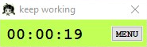
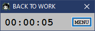

# Timer-chan
A clone of another timer app with some aesthetic changes. No frills.  
Original app: http://neilblr.com/post/58757345346  
<!-- archive: https://web.archive.org/web/20190213201147/https://neilblr.com/post/58757345346) -->

========================

  
when focused on chosen window (GOOD)  
  
  
when focused on other windows (DISGUSTING) 

### HOW TO:
1. open MENU
2. select Program #
3. click on the window of your program (make sure to have it open beforehand)
4. done! timer-chan will now begin tracking your time spent working as long as you are focused on the program. Tab to another window, and she'll pause until you resume.

You can select multiple programs, or change them at any time.

========================

Timer-chan wants you to work hard! OR ELSE.
